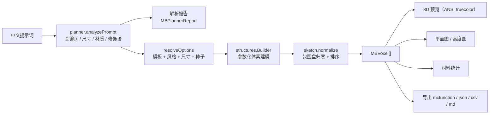
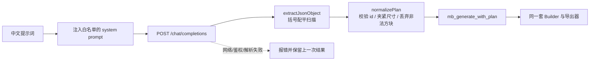

<div align="center">

# ⛏ Minecraft Builder

**用一句话描述，生成真正可建造的 Minecraft 建筑**

大模型规划建筑意图 → 确定性体素建模 → 终端 3D 预览 / 逐层平面图 / 一键导出 `.mcfunction`

一个**零依赖的 C11 终端应用**。没有 Electron、没有 Node、没有 three.js、没有 JSON 库、没有 HTTP 库——只要一个 C 编译器。

[](./LICENSE)


</div>

---

## 这是什么

一个跑在终端里的 Minecraft 建筑生成器。

你输入一句中文描述，比如：

> 帮我建一座现代风格的两层别墅，白墙大落地窗，尺寸 15x11

它会当场算出整套方块方案，用 **ANSI truecolor 在终端里画出等距 3D 预览**和逐层平面图，并导出可以直接在游戏里跑起来的 `/setblock` 指令。

**它不是一个"画得像"的演示，而是一个能真的盖出来的工具。** 导出的每一个方块坐标都在建筑包围盒内、没有重复、没有空洞，`.mcfunction` 的行数与方块数严格相等——这些都由自动化测试守着（见[开发与测试](#开发与测试)）。

```
┌───────────────────────────────────────────────────────────────────────────┐
│  ⛏ Minecraft Builder            本地规则引擎 · 无需联网                     │
│  现代简约 · 现代别墅   16 × 13 × 17   1342 方块   9 种材料                 │
├───────────────────────────────────────────────────────────────────────────┤
│  [1] 3D 预览   [2] 平面图   [3] 报告   [4] 导出   [5] 设置                 │
├───────────────────────────────────────────────────────────────────────────┤
│                        ▄▟▙▄                                                │
│                     ▗▟███████▙▖            ░░ 玻璃                          │
│                  ▄▟█████████████▙▄          ▒▒ 石砖                          │
│               ▗▟███████████████████▙▖       ▓▓ 深色橡木                      │
│               ▜█████████████████████▛       ██ 白色混凝土                    │
│               ▜█████████████████████▛                                      │
│                   ▀▀▀▀▀▀▀▀▀▀▀▀▀▀▀                                         │
├───────────────────────────────────────────────────────────────────────────┤
│  就绪 · 用时 3 ms                                                          │
├───────────────────────────────────────────────────────────────────────────┤
│  i 编辑提示词 · Enter 生成 · a AI/本地 · t 测试连接 · g 换变体 · Tab 切换  │
└───────────────────────────────────────────────────────────────────────────┘
```

> ### 🧠 关于"AI"的说明
>
> 这个项目的"AI"是真的接大模型，不是规则引擎套壳。但它把大模型放在了一个**很窄、很安全**的位置上：
>
> ```
> 你说的话 ──▶ 大模型 ──▶ 建筑意图（JSON）──▶ 确定性体素构建器 ──▶ 方块坐标
>                          类型/风格/尺寸/材质/命名        几何只由代码算
> ```
>
> 大模型负责它擅长的：听懂含糊的中文、判断该盖什么、定尺寸、挑配色、起个名字。
> 大模型**不**输出任何方块坐标——几何全部由参数化构建器算出来。
> 所以模型就算开始胡言乱语，最坏的结果也只是"选错了模板"，永远不可能给你一座盖不出来的建筑。
>
> **支持任意 OpenAI 兼容接口**：DeepSeek / OpenAI / Kimi / 智谱 GLM / 通义千问 / Ollama 本地模型，都在内置预设里，也可以填任意自建中转地址。
>
> **没配 Key 也能用**：关掉 AI 模式就是纯本地确定性规则引擎，完全离线、零成本、结果可复现。

---

## 功能特性

| | |
|---|---|
| 📦 **零第三方依赖** | 单文件 `mb.exe`，只要一个 C 编译器。JSON 解析器、HTTP 客户端、3D 渲染器全部手写 |
| 🖥️ **终端 TUI** | ANSI truecolor 逐像素等距投影，玻璃半透明、光源方块自发光，键盘驱动 |
| 🤖 **大模型规划** | 接任意 OpenAI 兼容接口，模型输出结构化建筑意图，支持一键测试连接 |
| 🗣️ **中文提示词理解** | 建筑类型、材质风格、体量、层数、显式尺寸、具体方块名，都能从一句话里抠出来 |
| 🏗️ **6 套参数化模板** | 现代别墅 / 原木小屋 / 城堡塔楼 / 树屋 / 石桥 / 城墙，每套都是真正"能住/能走"的结构 |
| 🎨 **7 套材质风格** | 现代简约 / 中世纪石造 / 乡村木质 / 沙漠砂岩 / 奇幻魔法 / 工业冷调 / 废墟苔痕 |
| 🛡️ **幻觉兜底** | 模型返回的每个 id 都会被校验（非法方块名丢弃、尺寸越界夹紧、未知模板回退），保证结果始终可建造 |
| 📐 **逐层平面图** | `[` `]` 翻层，下层以暗色"幽灵"叠加，一眼看清每层的墙线与开洞位置 |
| 🧱 **材料清单** | 每种方块的用量与占比，按用量排序——照着这个备料就行 |
| 🔍 **生成报告** | 把"这次是谁决定的、决定了什么"完全摊开：命中的关键词、识别到的材质、生效的修饰语、模型名与规划耗时 |
| 🌱 **种子可复现** | 同一提示词 + 同一种子 = 完全相同的结果；换个种子 = 同风格变体（不会重复扣 token） |
| 📦 **4 种导出** | `.mcfunction` / `.json` / 材料 `.csv` / 中文说明 `.md` |

---

## 构建

需要 **MinGW-w64 GCC**（推荐 [winlibs](https://winlibs.com/) 构建，自带 `mingw32-make`）。没有其它依赖。

```powershell
cd c
mingw32-make          # 编译出 build/mb.exe
mingw32-make run      # 编译并启动
mingw32-make test     # 编译并跑黄金数值测试
mingw32-make clean    # 清掉 build/
```

> **注意**：winlibs 工具链里**没有** `make`，只有 `mingw32-make`。直接敲 `make` 会找不到命令。

### 如果工具链装在带空格的路径里

`C:\Program Files (x86)\...` 这种路径会让 MinGW 连**空程序都链不出来**：GCC 的 `*endfile` spec 会把 `default-manifest.o` 以**未加引号**的绝对路径塞进链接命令，ld 在空格处断词，然后报 `cannot find C:/Program`。

本仓库的解法是用 `-specs` 覆盖掉那一个对象（控制台程序本来也不需要嵌入 application manifest）——见 [`c/tools/no-manifest.specs`](c/tools/no-manifest.specs)，`Makefile` 会在 Windows 上自动加上它。

**更省事的替代方案**：把工具链卸了重装到无空格路径（比如 `C:\mingw64`），这个 workaround 就完全用不上了。

---

## 操作

应用是**模态**的：默认所有字母都是命令，按 `i` 才把键盘交给提示词输入框——这是在没有一堆组合键的前提下把 ASCII 字母打进中文提示词的最干净做法。

| 键 | 作用 |
|---|---|
| `i` | 编辑提示词（输入模式下 Enter 确认、Esc 取消） |
| `Enter` | 用当前提示词生成建筑 |
| `a` | 切换 AI 规划 / 本地规则引擎 |
| `t` | 测试大模型连接（调 `/models` 核对模型名在不在） |
| `g` | 换一个变体（对**已缓存的方案**重新抖种子，不重复扣 token） |
| `Tab` / `1`-`5` | 切换标签页：3D 预览 / 平面图 / 报告 / 导出 / 设置 |
| `←` `→` `↑` `↓` | 旋转视角（3D 预览页） |
| `[` `]` | 切换查看的楼层（平面图页） |
| `-` `+` | 缩放 |
| `q` | 退出 |

### 标签页

- **3D 预览**：ANSI truecolor 逐像素等距投影渲染，玻璃半透明、光源方块自发光、带后沿明暗。用真彩色转义序列直接在终端里画出来，不依赖任何图形库。
- **平面图**：逐层俯视图，`[` `]` 翻层，下层以暗色"幽灵"叠加。
- **报告**：把"这次是谁决定的、决定了什么"摊开——命中的关键词、识别到的材质、生效的修饰语，以及模型名 / endpoint / 规划耗时。
- **导出**：`.mcfunction` / `.json` / `.csv` / `.md` 四种，Enter 写入当前目录。
- **设置**：服务预设 / Base URL / API Key / 模型名 / 温度 / JSON 模式。

---

## 接入大模型

在 `设置` 页填三项就能用：

| 字段 | 说明 |
|---|---|
| 服务预设 | 内置 DeepSeek / OpenAI / Kimi / 智谱 GLM / 通义千问 / Ollama 本地 六个预设，选中会自动填好下面两项 |
| Base URL | 任何 OpenAI 兼容地址，比如 `https://api.deepseek.com/v1`，自建中转也能填 |
| 模型名 | 比如 `deepseek-chat` |
| API Key | 随请求直接发给模型服务，仅保存在本机配置文件里 |

填完按 `t` 可以先确认通不通（会调 `/models` 列出可用模型并核对你要用的那个在不在），再切回预览页按 `a` 打开 AI 模式。

Ollama 预设的 API Key 可以留空；本地跑之前需要放开跨域：

```bash
OLLAMA_ORIGINS='*' ollama serve
```

### 模型到底被允许做什么

发给模型的系统提示里会**注入真实的 id 白名单**——6 个模板 id、7 个风格 id、约 40 个方块 id，全是代码里的目录。模型只能从这些里面挑，然后返回一份这样的 JSON：

```json
{
  "structure": "castle-tower",
  "style": "medieval",
  "scale": "large",
  "width": 14, "depth": 14, "height": 30, "floors": 3,
  "palette": { "wall": "stone_bricks", "roof": "deepslate_bricks" },
  "name": "灰石哨塔",
  "keywords": ["城堡", "塔楼"],
  "modifiers": ["多层结构"],
  "notes": ["三层石塔，带雉堞。"]
}
```

拿到之后**全部重新校验一遍**，这一步是硬性的：

| 模型给了什么 | 会发生什么 |
|---|---|
| 不在白名单里的方块名 | 静默丢弃，该槽位回退成风格默认材质 |
| `width: 999` | 夹紧到 48 |
| 不存在的模板 id | 回退到默认模板 |
| 用 ``` 包起来的 JSON / JSON 前后带解释文字 | 照常解析（括号配平扫描，不用正则硬切） |
| 返回的不是 JSON | 报错并保留上一次可用结果，**不会**把界面搞崩 |

返回值里只要有坐标，就是构建器算的——模型碰不到几何。这是为了让它**最坏也只能"选错风格"，无法产出盖不出来的东西**。

### 网络层

Windows 上用系统自带的 **WinHTTP**；如果初始化失败，会退化成 **spawn `curl.exe`**。两条路都只发一次 POST，没有第三方依赖、没有 TLS 库。

### 不用大模型的时候

按 `a` 切回本地确定性规则引擎：同样的提示词 + 同一种子 = 完全相同的结果，零网络请求、零成本。**两条路径共用同一套构建器和导出器**，所以导出结果、材料统计、测试断言全部通用。

---

## 本地规则引擎支持的提示词写法

**不开 AI 模式时**，本地引擎会用下面这套规则解析你的话：**没有提到的部分会自动补默认值**，所以你写一句话就够了。

> 开了 AI 模式就不用管这些写法了——直接把话说清楚，模型自己会判断。但显式写出来的数字和方块名依然是硬约束，会被强制遵守。

### 建筑类型

| 你会说的词 | 命中的模板 |
|---|---|
| 别墅、房子、住宅、现代、洋房 | 现代别墅 |
| 小屋、木屋、乡村、原木、烟囱 | 原木小屋 |
| 城堡、塔楼、要塞、石砖 | 城堡塔楼 |
| 树屋、树上、森林、梦幻 | 树屋 |
| 桥、拱桥、跨河 | 石桥 |
| 城墙、围墙、防御、角楼 | 城墙 |

### 显式尺寸

```
尺寸 15x11          宽 20              长 30
深 12               高 24              两层 / 3 层
```

- `15x11` → 宽 15、深 11
- 显式写出的尺寸**会覆盖**模板默认比例，并且**不受随机种子抖动影响**（你写 20 就一定是 20）
- 只写"宽"不写"深"时，另一维按模板比例推算

### 具体方块

直接在句子里写方块中文名即可，例如：

```
...用白桦木板做墙，屋顶铺深色橡木，窗户用玻璃...
```

支持约 40 种方块，覆盖石材 / 木材 / 玻璃 / 自然 / 羊毛 / 装饰 / 光源七大类（见 [`c/src/materials.c`](c/src/materials.c)）。

### 修饰语

`两层结构`、`大面积采光`、`带烟囱`、`带护栏`、`带塔楼` 等修饰语会被识别出来，并在报告里列给你看。

---

## 导出格式

### 1. `.mcfunction` —— 真正拿去游戏里用的那个

生成的是一串带注释头的指令：

```mcfunction
# Minecraft Builder
# 建筑：现代简约 · 现代别墅
# 尺寸：17 × 13 × 13
# 方块数：1220
# 坐标以执行位置为相对原点，建议先备份存档

setblock ~0 ~0 ~0 minecraft:white_concrete
setblock ~1 ~0 ~0 minecraft:white_concrete
...
```

**导入步骤：**

1. 导出得到比如 `现代简约-现代别墅.mcfunction`
2. 放进数据包目录：`<存档>/datapacks/<包名>/data/<命名空间>/function/`
   （`<命名空间>` 要和 `data/` 下的文件夹名一致，只能是 `a-z0-9_-.`）
3. 确保数据包里有一个 `pack.mcmeta`
4. 进游戏执行 `/reload`
5. **站到你想要的起始位置**（建议先找一块平地），然后执行：

   ```
   /function <命名空间>:<文件名>
   ```

> ⚠️ 坐标是**相对于执行位置**的（`~` 记法），所以站在哪儿就从哪儿开始盖。建筑可能会长得很高，建议在创造模式空地上先试跑一次。

### 2. `.json` —— 结构化方案

完整的 `blocks[]`、`palette`、`stats`、`report`，方便你写脚本二次加工。

### 3. `.csv` —— 材料采购单

```
id,name,count,percent
minecraft:birch_planks,白桦木板,493,40.4
...
```

### 4. `.md` —— 中文说明书

把上面这些整理成一份可读的建造文档，包含结构摘要、材料表、提示词解析结果。

---

## 项目结构

```
c/
├─ include/
│  └─ mb.h            # 全部公开声明：Arena / JSON / 材质 / 体素 / 规划器 / LLM / 导出 / 渲染
├─ src/
│  ├─ util.c          # Arena 内存池、SBuf、UTF-8↔UTF-16、FNV-1a、mulberry32、trim、大小写比较
│  ├─ json.c          # 手写 JSON 解析 / 序列化 / 转义（不引第三方库）
│  ├─ materials.c     # 40 种方块：id、中文名、分类、近似颜色、发光标记
│  ├─ voxel.c         # 稀疏体素 Sketch + Builder（box/rect/perimeter/cylinder/ellipsoid/
│  │                  #   gableRoof/crenellation/ringMerlons/cutOpening/glaze/normalize）
│  ├─ structures.c    # 6 套参数化模板 + 7 套材质风格 + 关键词表
│  ├─ planner.c       # 两条路径：本地 analyzePrompt 与模型 plan 映射，共用构建器
│  ├─ llm.c           # ★ 唯一联网的模块：system prompt、白名单注入、响应校验/夹紧
│  ├─ http_winhttp.c  # WinHTTP POST（失败时回退到 spawn curl.exe）
│  ├─ render.c        # ANSI truecolor 等距 3D 渲染 + 逐层平面图
│  ├─ term.c          # 终端能力探测、光标/清屏、显示宽度（CJK = 2 列，ANSI 不计宽）
│  ├─ export.c        # mcfunction / json / csv / md
│  └─ main.c          # 模态终端界面
├─ tests/
│  └─ test_core.c     # 243 项黄金数值检查
├─ tools/
│  └─ no-manifest.specs  # 带空格路径下的链接 workaround
├─ Makefile
└─ LICENSE / README.md
```

---

## 工作原理

不开 AI 模式（纯本地，默认路径）：



开了 AI 模式：**前两步换成一次模型调用，后面完全一样。**



核心设计取舍：

- **稀疏体素**：用哈希表存 `(x,y,z) → Voxel`。建筑天然是空心的，密集三维数组会浪费掉大部分内存。
- **确定性优先**：所有随机都走 `mulberry32(seed)`，代码里没有 `rand()`。这让"同种子同结果"成为可以写进测试的硬保证。
- **模板而非自由生成**：6 套模板各自保证结构合理性（有地基、有门、有通路、屋顶不悬空）。自由生成的体素看起来像建筑、走进去是灾难。
- **坐标归一化**：任何模板建完后统一把最小角挪到原点，导出时不用再担心负坐标。
- **让模型只做选择题**：模型在"想要什么"上比规则灵活得多，在"几何是否成立"上则完全不可信。所以边界划在这里——它的输出是一份**意图**，不是坐标。
- **不信任返回值**：所有 id 过白名单、所有数字夹到合法区间、解析失败就抛错。宁可报错，也不要把半截幻觉渲染出来。

### 几个实现取巧的地方

- **Arena 内存池**：一次 `malloc` 一大块，所有中间对象（体素、字符串、JSON 节点）从里面 bump 分配，整轮结束一次性释放。没有 `free` 乱飞，也没有泄漏可言。
- **逐位对齐 JS 语义**：随机数用同款 `mulberry32`，字符串哈希用同款 **FNV-1a**，且哈希/取长度的单位是 **UTF-16 code unit**——因为 `String.prototype.length` / `charCodeAt` 也是这个单位。中文关键词的打分、种子推导因此和原实现逐位一致。`??` 的短路语义也被复刻：显式给出尺寸时**不消耗**随机数，否则种子序列会偏。
- **显示宽度**：`display_width()` 按码点算列宽（CJK 记 2 列），并跳过 ANSI 转义序列——不然彩色输出会把整个界面撑歪。

---

## 开发与测试

```bash
cd c
mingw32-make test
```

`tests/test_core.c` 是一份**黄金数值**测试：把参考实现跑出来的结果当作标准答案，逐条比对。覆盖：

```
> templates (seed 20260101)
  . modern-house   16x13 h17   1342 blocks  9 materials
  . cabin           9x10 h10    334 blocks  7 materials
  . castle-tower   11x11 h24    960 blocks  8 materials
  . treehouse      15x15 h15    870 blocks  8 materials
  . bridge         20x5  h9     424 blocks  6 materials
  . castle-wall    28x5  h12    942 blocks  5 materials

> material styles (seed 7)
> prompt parsing
> determinism
> model response extraction and validation
> model plan to building
> exporters
> helpers, urls and presets

[PASS]  243 checks, 0 failures
```

包括但不限于：

- 每个模板 × 每个风格都能稳定产出方块，尺寸为正
- 所有方块 id 都在材质目录里存在
- 没有重复坐标、没有越界坐标
- 材料统计求和 = 总方块数
- `.mcfunction` 的 `setblock` 行数 = 方块数，且不含 `NaN`
- 提示词解析断言（`宽20` vs `宽30` → 宽度差恰好 10；显式尺寸不被种子抖动覆盖）
- 确定性断言（种子 42 两次结果完全一致；种子 43 结果不同）
- **大模型响应映射断言**：代码块包裹的 JSON 能解析、越界尺寸被夹紧、未知模板回退、非法方块名被丢弃、UI 锁定优先于模型选择、空计划也能出结果（全部离线，不打网络）

> 真正的 HTTP 调用不在测试范围内——它需要密钥，也不该在 CI 里花钱。被测的是那份**映射逻辑**（`extractJsonObject` / `normalizePlan` / `generateWithPlan`），它是纯函数。

---

## 路线图

- [x] ~~**零依赖 C 移植**：手写 JSON / WinHTTP / ANSI 渲染，黄金数值与原实现逐条对齐~~
- [x] ~~**LLM planner 适配器**：让模型输出结构化的建筑意图，其余管线完全复用~~
- [ ] **流式输出**：规划过程中显示模型的实时推理，而不是干等
- [ ] **局部重生成**：选中一块区域，只让模型重做这部分
- [ ] **更多模板**：中世纪村庄、悬空岛、下沉式庭院、红石小屋
- [ ] **结构文件 `.nbt` / `.schematic` 导出**：配合 WorldEdit 直接粘贴
- [ ] **Java / 基岩版语法差异处理**：方块 id 映射表
- [ ] **跨平台 HTTP**：Linux/macOS 上用 BSD sockets 替掉 WinHTTP

---

## 贡献

Issue 和 PR 都欢迎。如果加新建筑模板，请一并：

1. 在 `structures.c` 里注册（含中文名与关键词）
2. 补一条提示词解析的断言
3. 确保 `mingw32-make test` 全绿

---

## 许可证

[MIT](./LICENSE) © 2026 sijiyu521

---

<div align="center">

## English

**Minecraft Builder** — describe a build in natural language, get a constructible Minecraft structure.

A **zero-dependency C11 terminal application**: prompt → voxel model → ANSI truecolor 3D preview, per-layer blueprint, material list, and one-click `.mcfunction` export you can actually run in-game.

- **Stack**: C11 + the standard library. On Windows the only external library is `winhttp`, which ships with the OS (with a `curl.exe` fallback). JSON parsing, HTTP, and the 3D isometric renderer are all hand-written. No Node, no three.js, no third-party packages.
- **Real LLM integration.** Any OpenAI-compatible endpoint (DeepSeek / OpenAI / Kimi / GLM / Qwen / local Ollama) — the model returns a *structured build intent* (template, style, dimensions, palette, name), and the deterministic parametric builders compute every block coordinate. A hallucinating model can only pick the wrong template; it can never emit an unbuildable structure. Every id the model returns is re-validated against the real catalog: unknown block names are dropped, out-of-range dimensions clamped, unknown templates fall back.
- **Offline fallback.** Turn AI mode off and it runs as a deterministic local rule engine — no network, no key, no cost.
- **Reproducible**: seeded RNG, same prompt + same seed = identical output.
- **243-check golden-value test suite** that pins the exact block counts per template/style.
- **Supports Chinese keywords** for structure type, dimensions (`15x11`, `宽20 深12`), floor count and block materials.

```bash
cd c && mingw32-make run
```

MIT licensed.

</div>
